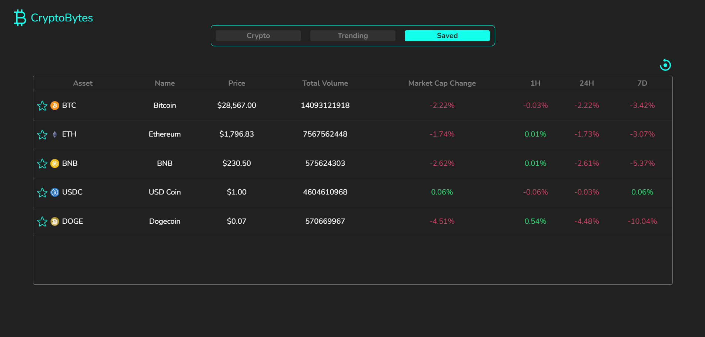

# React Website Tutorial: ⭐Build Feature Rich Crypto Screener App with Tailwind CSS

This repository contains final code for Crypto Screener Application in ReactJS.  

For Demo and Final Code checkout the following link:  
<a href="https://ng-cryptobytes.netlify.app/" target="_blank">Crypto Screener Application in ReactJS</a>

Here are the final code files👇:  
https://github.com/niladrighoshal/CryptoBytes  

### Images of The Crypto Screener Website:

### Resources Used in This Project

- Icons from https://iconify.design/  
- Fonts from https://fonts.google.com/  
- API from https://www.coingecko.com/en/api  

### External Libraries used in this project:

- [Tailwind css](https://tailwindcss.com/)  
- [recharts](https://recharts.org/en-US/)  

